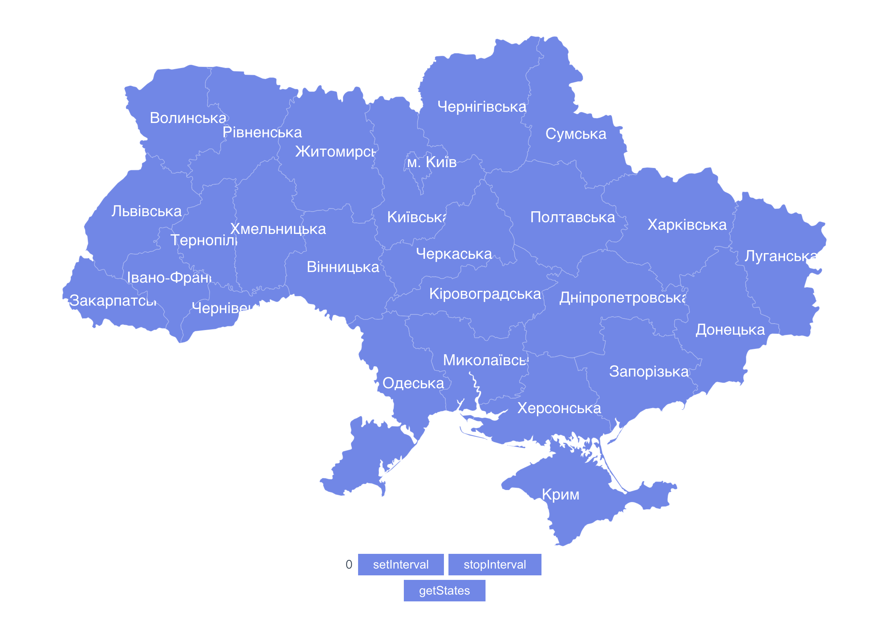
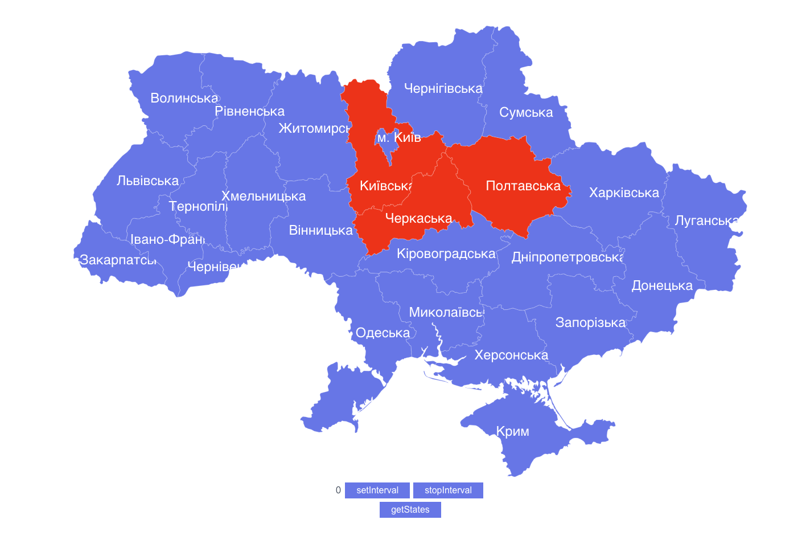

# 🇺🇦 VUE ALARM UA MAP  🚨


## Implements api.ukrainealarm.com API that returns info about Ukraine air raid alarms. Request API key via form on api.ukrainealarm.com and change .env file (add VUE_APP_API_TOKEN)

### Project setup
```
yarn install
```

### Compiles and hot-reloads for development
```
yarn serve
```

### Compiles and minifies for production
```
yarn build
```